# Darwin-AWS-Cloud-Security-Lab
Hands-on AWS Cloud Security lab demonstrating EC2 deployment, IAM user management, Security Groups, CloudTrail auditing, CloudWatch monitoring, Amazon S3 log storage, and AWS security best practices using AWS Free Tier.

---

## Objectives

- Deploy a secure Amazon EC2 instance
- Configure AWS Identity and Access Management (IAM)
- Create and manage Security Groups
- Enable CloudTrail for account auditing
- Monitor cloud resources using CloudWatch
- Store CloudTrail logs in Amazon S3
- Explore AWS Billing and Free Tier monitoring
- Learn AWS cloud security best practices

---

## Technologies Used

- Amazon EC2
- AWS IAM
- Amazon S3
- AWS CloudTrail
- Amazon CloudWatch
- AWS Billing & Cost Management
- AWS Security Groups

---

## Skills Demonstrated

- Cloud Infrastructure Deployment
- Identity and Access Management (IAM)
- Role-Based Access Control (RBAC)
- Network Security
- Cloud Monitoring
- Security Auditing
- Log Management
- AWS Administration
- Cloud Security Fundamentals

---

# Lab Tasks

## 1. Launched an Amazon EC2 Instance

Created a Linux EC2 instance using the AWS Free Tier and generated an SSH key pair for secure access.

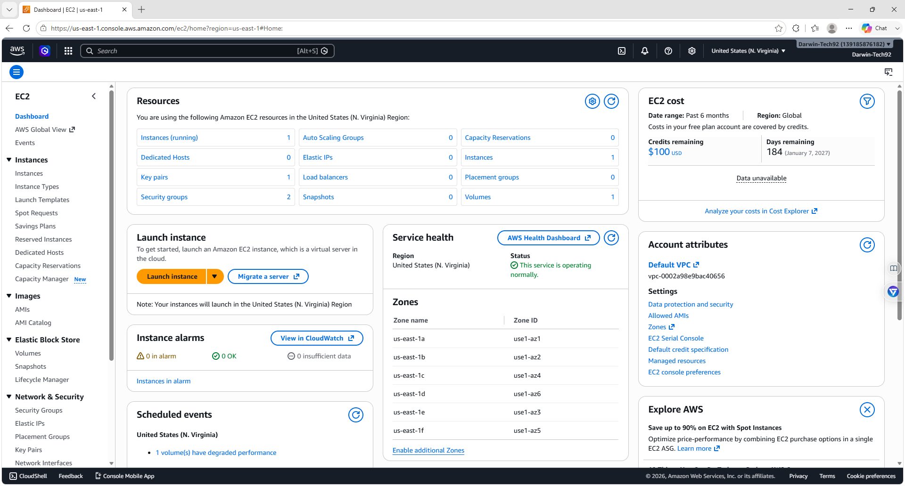

---

## 2. Successfully Launched the EC2 Instance

Verified the successful deployment of the virtual machine.

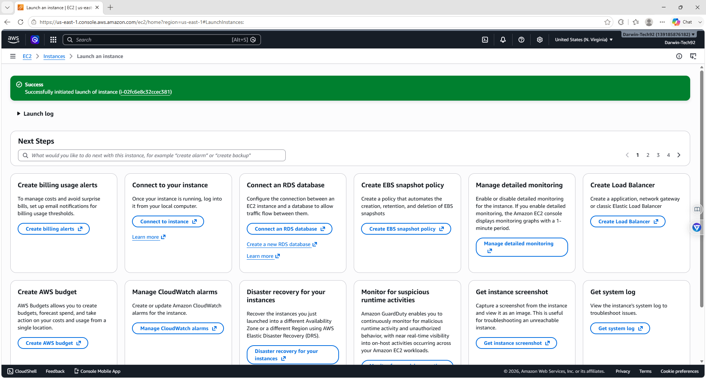

---

## 3. Verified Running EC2 Instance

Confirmed the EC2 instance was running and passed AWS status checks.

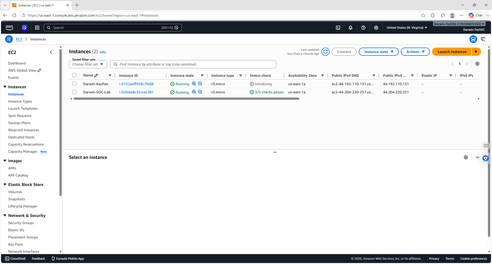

---

## 4. Configured Security Group

Created and reviewed inbound SSH security group rules to control access to the EC2 instance.

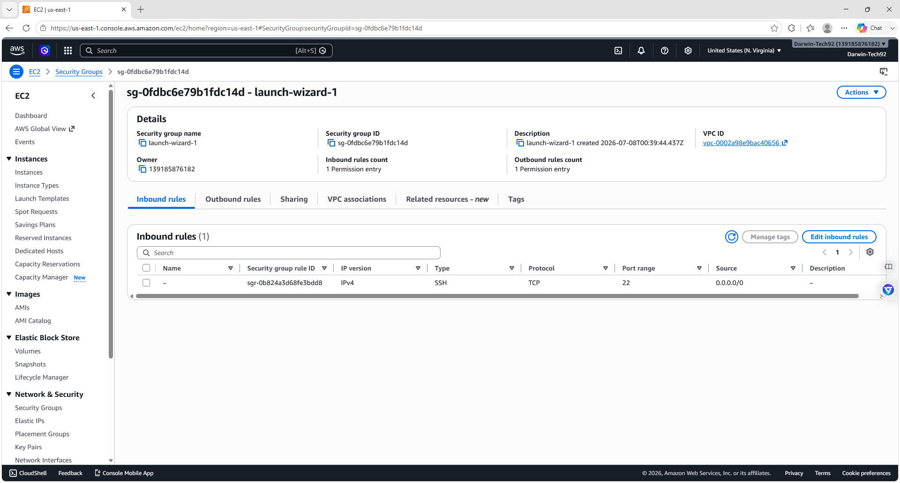

---

## 5. IAM Dashboard

Reviewed the AWS Identity and Access Management (IAM) Dashboard, including security recommendations and account resources.

---

## 6. Created IAM User

Created a dedicated IAM user with AmazonEC2ReadOnlyAccess permissions following AWS security best practices.

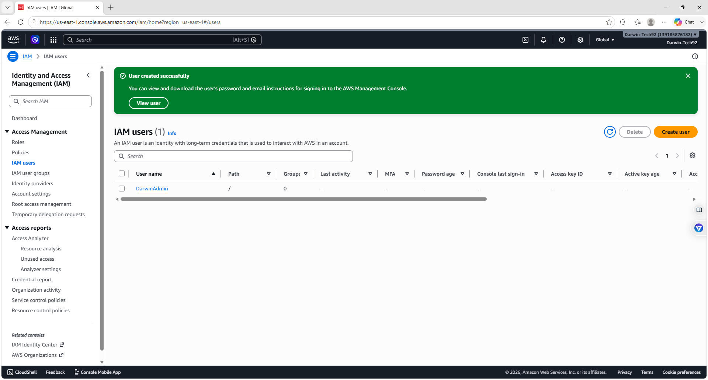

---

## 7. CloudTrail Dashboard

Configured AWS CloudTrail to continuously record account activity and API events.

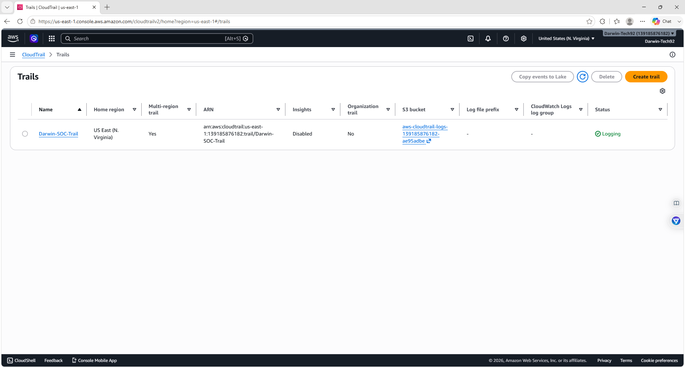

---

## 8. CloudTrail Event History

Reviewed recorded management events generated during the lab.

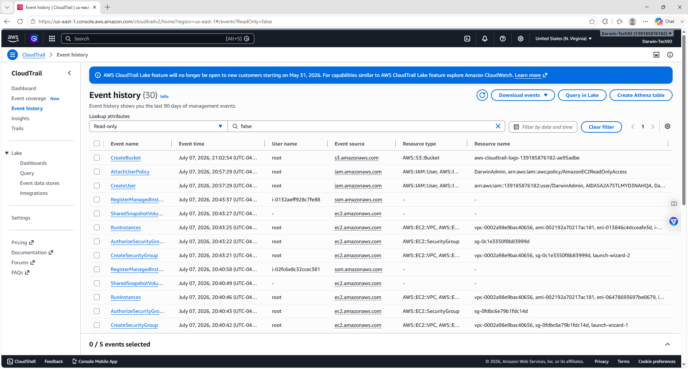

---

## 9. CloudWatch Dashboard

Accessed CloudWatch to monitor AWS resources, logs, alarms, and metrics.

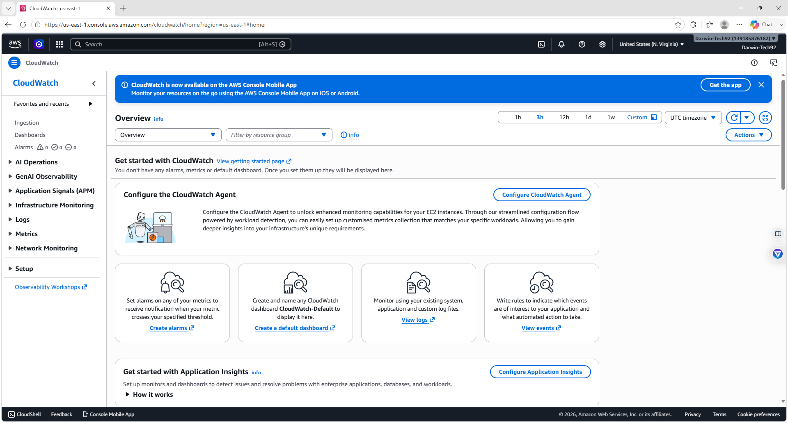

---

## 10. Amazon S3 Bucket

Verified the CloudTrail log storage bucket automatically created by AWS.

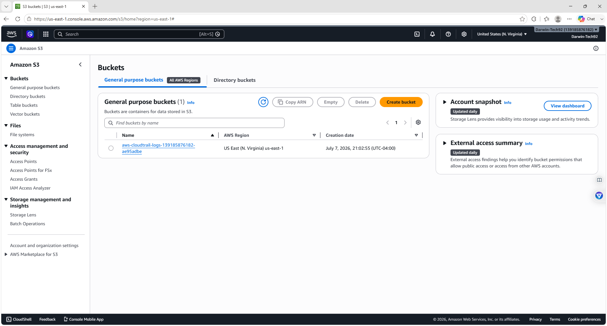

---

## 11. Billing & Free Tier

Reviewed the Billing and Cost Management dashboard and Free Tier usage.

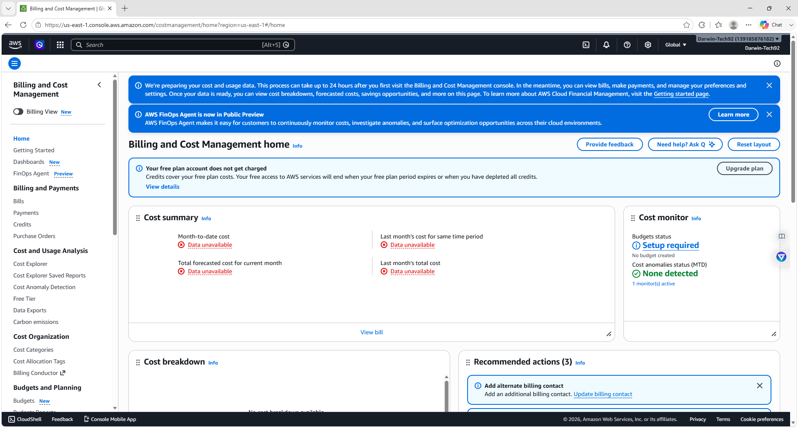

---

## 12. AWS Security Resources Overview

Reviewed IAM security recommendations, account resources, and AWS security management tools.

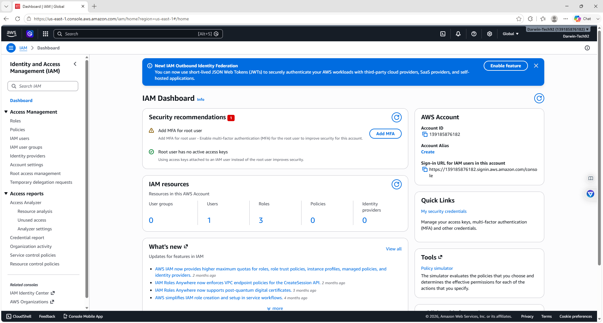

---

# Key Takeaways

This lab demonstrates how AWS security services work together to protect cloud resources:

- Amazon EC2 provides secure virtual servers.
- IAM controls authentication and permissions.
- Security Groups act as virtual firewalls.
- CloudTrail records AWS API activity.
- CloudWatch monitors infrastructure health.
- Amazon S3 securely stores audit logs.
- Billing tools help monitor cloud spending.

---

# Learning Outcomes

After completing this project, I gained experience with:

- AWS Cloud Administration
- EC2 Deployment
- IAM User Management
- Cloud Security Monitoring
- Cloud Auditing
- Infrastructure Logging
- AWS Security Best Practices
- Basic Cloud Governance

---

## Author

**Darwin Brown**
